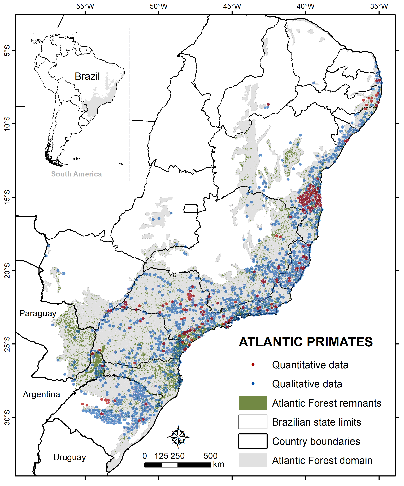

# ATLANTIC-PRIMATES
--------------------------------------------------------

### **ATLANTIC-PRIMATES: A DATASET OF COMMUNITIES AND OCCURRENCES OF PRIMATES IN THE ATLANTIC FORESTS OF SOUTH AMERICA**

ATLANTIC-PRIMATES dataset is part of the <a href="https://github.com/LEEClab/Atlantic_series">ATLANTIC series</a>, on which research teams are compiling biodiversity information of Atlantic Forest biome. This paper follows previous published data papers in <a href="https://esajournals.onlinelibrary.wiley.com/doi/toc/10.1002/(ISSN)1939-9170.AtlanticPapers">Ecology</a>. 

The dataset was published in Ecology:

Culot et al. 2018. Atlantic-Primates: a dataset of communities and occurrences of primates in the Atlantic forests of South America. *Ecology*.

This repository aims at keeping updates on the ATLANTIC-PRIMATES dataset.

### Abstract 

Here, we compiled a dataset of 4678 georeferenced locations of 26 native and 1 introduced primate species, as well as hybrids within each genera of Callithrix and Alouatta. The dataset includes 630 primate communities, 7,368 single species occurrences and 349 estimates of primate population sizes, covering most natural forest types of the tropical and subtropical Atlantic Forest of Brazil, Paraguay and Argentina. On average, primate communities of the Atlantic Forest harbor 2±1 species (range=1-6). However, about 41% of primate communities contain only one species. The most common species are Alouatta guariba (N=2,169 records) and Sapajus nigritus (N=990). The least common species are Leontopithecus caissara (N=34), Sapajus flavius (N=44), and Callicebus barbarabrownae (N=46). Primate density varies from 0.00438 individuals/km² (Alouatta guariba at Fragmento do Bugre, Paraná, Brazil) to 240 individuals/km² (Callithrix penicillata at Mata Joaquim Egidio, Sao Paulo, Brazil). Our dataset reflects disparity between the numerous primate census conducted in the Atlantic Forest, in contrast to the scarcity of estimates of population sizes and densities.

 

<b>Figure 1.</b> Distribution of the primate records of the ATLANTIC-PRIMATES dataset in the Atlantic Forest. Records are from 1815 to 2017; several populations may thus be extinct today. The gray colors show the domain of the Atlantic Forest and the green colors show the remaining Atlantic Forest patches (Ribeiro et al. 2009). Blue dots represent qualitative data of primate records (presence data only) and red dots represent quantitative data of primate records, i.e with an estimation of abundance and/or density.

### Contact

Correspondence and requests for materials should be addressed to Laurence Culot (lculot@rc.unesp.br) and Milton C. Ribeiro (miltinho.astronauta@gmail.com).

## CLASS I. DATA SET DESCRIPTORS

### A. Data set identity:

Title: ATLANTIC PRIMATES: A dataset of communities and occurrences of primates in the Atlantic Forests of South America.

### B. Data set and metadata identification codes:

Culot_etal_MetadataS1.pdf: metadata document with data descriptions.

DataS1.zip: dataset with ATLANTIC-PR_References.csv, ATLANTIC-PR_Quantitative.csv, ATLANTIC-PR_Community.csv, and
ATLANTIC-PR_Occurrence.csv.

## Principal Investigators:

**1. Laurence Culot, Lucas Augusto Pereira, Lisieux Franco Fuzessy, and Anne
Sophie de Almeida e Silva**  
Universidade Estadual Paulista (UNESP), Instituto de Biociências, Departamento de
Zoologia, CP. 199, Rio Claro, São Paulo, 13506-900, Brazil

**2. André Luis Regolin, Milton Cezar Ribeiro, and Mauro Galetti**  
Universidade Estadual Paulista (UNESP), Instituto de Biociências, Departamento de
323 Ecologia, CP. 199, Rio Claro, São Paulo, 13506-900, Brazil

**3. Andre Hirsch**  
Universidade Federal de São João del Rei (UFSJ), Departamento de Ciências
Agrárias, Rod. MG-424, km 48, 35.701-970 Sete Lagoas, Minas Gerais, Brazil

**4. Míriam Plaza Pinto and Adriana Almeida de Lima**  
Universidade Federal do Rio Grande do Norte (UFRN), Centro de Biociências,
Departamento de Ecologia, 59072-970, Natal, Rio Grande do Norte, Brazil
